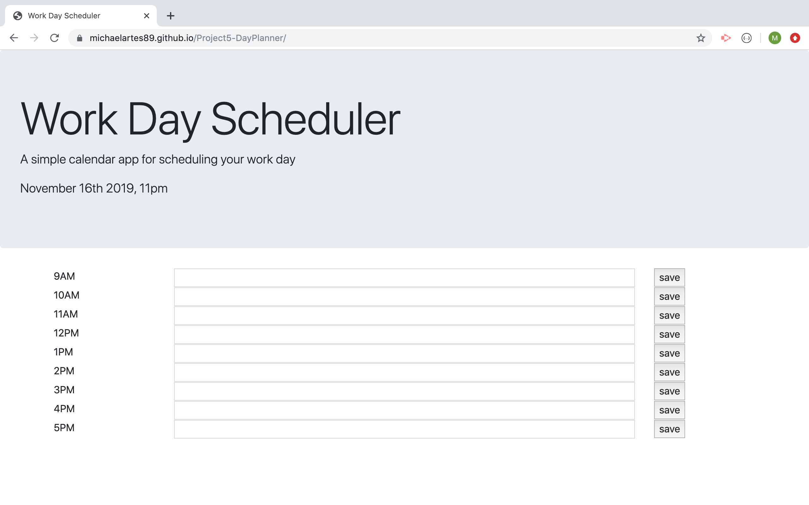

# Project5-DayPlanner
This project is a simple calander application that allows users to save elements for each hour of the day. 
# Features
The page shows the current date and hour at the top of the screen and has spaces for each our of the standard business day from 9AM-5PM. When a user enters input into any of the hour fields and clicks save, the input is saved in local storage so it will remain after the page is refreshed. 
# screen shot 

# link
<a href="https://michaelartes89.github.io/Project5-DayPlanner/"> Click Here for Link to Page</a>

# Developer Story
Working on this project helped me take some important steps forward in my growth processes as a developer. In contrast to my experience on some of the previous assignments in which I heavily relied on entry-level and generally amatuer behaviors, on this project I was able to engage in more of a pro-style process. I am optimistic that this expereince will be a springboard into more success moving forward. 
# gaining skills 
The most important part of this project for me was gaining more experience with dynamically updated HTML and CSS powed by jQuery. I made a lot of of progress in this area over the course of this project. My initial aproach was to write HTML directly on the index.html page to create all the elements on the page but then I decided to create them using jQuery on the script.js page. This let me practice and build expereince utilizing Jquery to do things including: creating elements, adding attributes, storing user input from an element, appending elements to the DOM. I also started out writing  seperate blocks of code that would apply nearly identical ways to each of 8 time boxes in the schedule program but then I decided to employ the DRY principle and create a for loop to more the process more efficient.  
# learning to troubleshoot 
While working on this project, I spend much more time actualy using the console compared to my prior expereince. That may have been the biggest factor in begining to feel like a professional developer vs an amatuer coder. I also got to utilize the benefit of version control, at one point a changed a line of code on my script.js file, which caused an error on something that had previouly been working. I had already git pushed the working code to my github repository and I was able to go back an look at the previous version to work at the difference. This is very valuable as projects become more complex. 

# Thanks 
For classmates,teachers, and studygroup partners! 

